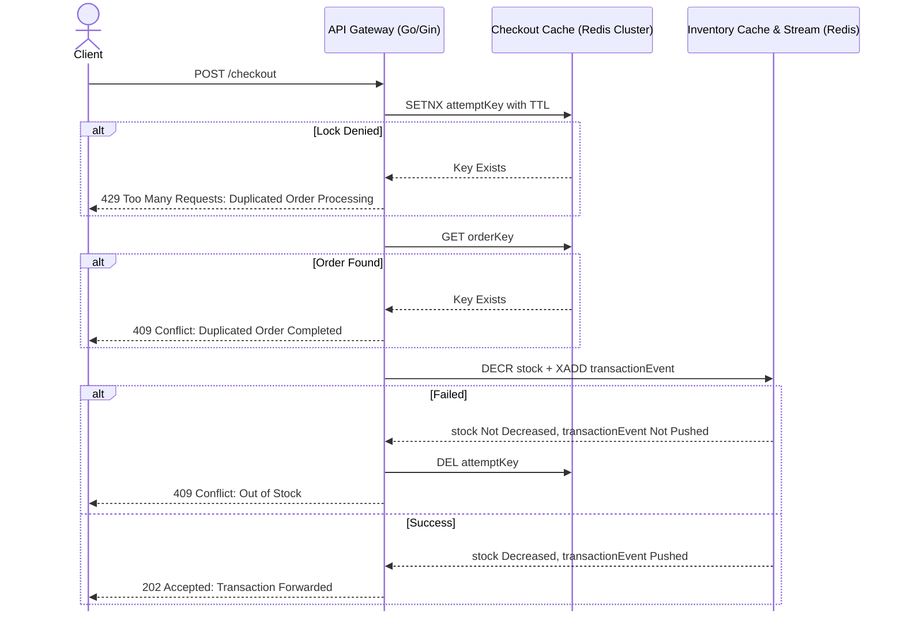
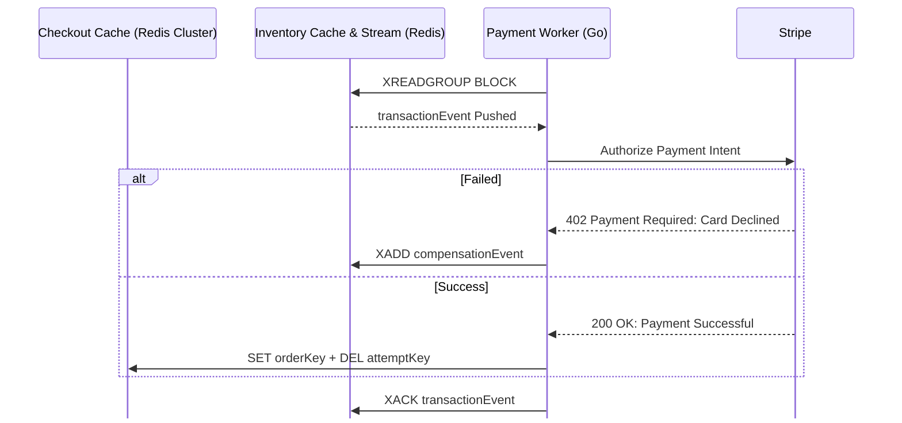
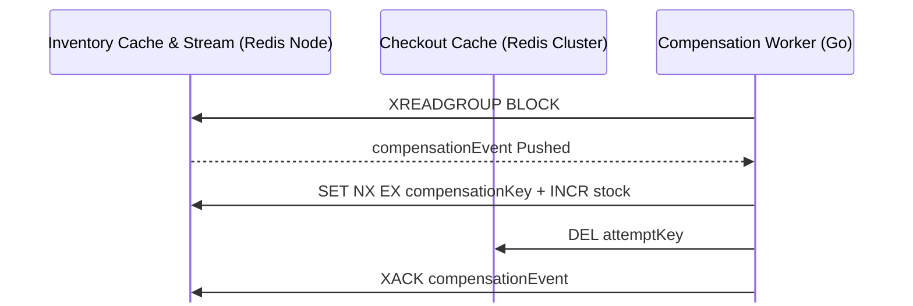
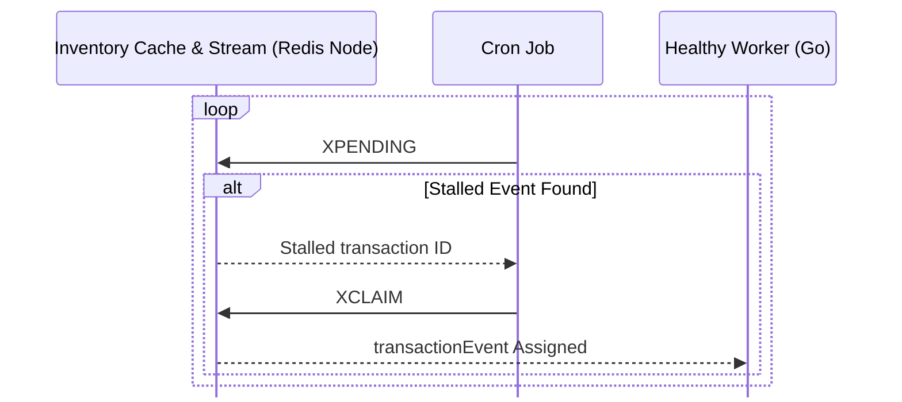

# Design

## Problem Statement
Anti-botting solutions for high-demand physical item releases are currently incomplete. Existing approaches focus heavily on network-level bans (IP blocking) and payment filtering. Both are easily bypassed by resellers utilizing residential proxy networks and generated Virtual Credit Cards (VCCs).
FairCheckout approaches this problem from a completely different angle. By using the physical delivery address as the strict, normalized unique identifier for orders, we create an un-forgeable bottleneck for resellers, rendering mass automated purchases logistically impossible.
### Goals
FairCheckout must provide a frictionless checkout experience for genuine fans while surviving extreme, sudden bursts of traffic from automated programs.
- **Throughput & Latency**: The system can sustain an average of 5,000 checkout requests per second for 10-minute drop windows, maintaining sub-100ms p99 latency.
- **Inventory Guarantees**: The system never oversells under any circumstances. Inventory decrements must be strictly atomic.
- **Jigging Resistance**: The system enforces a "one-per-household" rule using address normalization to detect address manipulation (jigging) in real-time.
### Non-Goals
FairCheckout is strictly a transaction coordinator with inventory reservation capabilities. It has unavoidable and intended functional limitations. 
- **Traffic Scrubbing**: The system cannot actively detect or block bot traffic at the network level. It relies on the merchant to provide standard edge protection (e.g., Cloudflare Turnstile).
- **Absolute Jigging Prevention**: The system does not guarantee a 0% false-positive and 0% false-negative rate for address matching. We use an aggressive algorithm for address normalization to maintain low latency. This introduces tradeoffs such as occasionally missing sophisticated jigs, and intentionally blocking genuine buyers.
- **Payment Gateway Implementation**: The system does not handle payment processing. We are integrating *Stripe* to handle PCI compliance and card authorization.

## Architecture
### Checkout Flow

A checkout request is processed in 2 decoupled stages. The API Gateway instantly returns an HTTP `202 Accepted` response once a transaction is successfully queued, allowing the client to poll a lightweight endpoint for the final payment status. This architecture isolates synchronous rate-limiting from downstream third-party latency to maximize API throughput while guaranteeing eventual financial consistency.
- **Stage 1**: The API Gateway filters requests based on the user's normalized address. If a distributed lock (`attemptKey`) or completion record (`orderKey`) exists for that address, the request is rejected to prevent bot floods and duplicate processing. Otherwise, the Gateway decrements the inventory and append a `transactionEvent` to a Redis Stream atomically, instantly returning a `202 Accepted` to the client.
- **Stage 2**: A pool of background Go workers uses a Redis Consumer Group to pull events from the stream. The worker constructs a Payment Intent and attempts to authorize it via Stripe. If the payment succeeds, the worker sets a permanent `orderKey` and deletes the temporary lock atomically. If the payment fails, the worker pushes a `compensationEvent` to trigger a rollback of the inventory. Finally, the worker issues an `XACK` to mark the  `transactionEvent` as processed.
### Rollback

If a transaction fails during stage 2, the system orchestrates a rollback to maintain eventual consistency. A compensation worker consumes `compensationEvents` from the stream. It increments the product stock back into the inventory stock and deletes the `attemptKey` from Checkout Cache. This frees the inventory for the next customer and allows the original customer to retry the request. 
### Recovery

To prevent transactions from becoming permanently trapped if a payment worker crashes, the system uses a background cron job, querying Redis via `XPENDING` to locate any messages left unacknowledged in the Inventory Cache. It uses `XCLAIM` to forcefully reassign ownership of the stalled transaction to a healthy background worker.
## Data Modeling
### Checkout Cache
Checkout Cache utilizes a horizontal scaled Redis cluster, provisioned to prevent CPU thread saturation during high volume sales. Customer addresses are excluded from the cache for compliance. The API normalizes and hashes the address prior to caching. 
To support concurrent multi-product sales without cross-blocking customer requests, concurrency locks include both the hashed address and `productID`. Two stateful keys are managed per transaction.
- **attemptKey** (`attempt:{<hashedAddress>:<productID>}`):  A distributed lock (with TTL) operating as a concurrency guard to reject concurrent duplicate requests.
- **orderKey** (`order:{<hashedAddress>:<productID>}`): A persistent idempotency record verifying a completed checkout state.
Both keys store `transactionID` as the value to maintain distributed traceability. The key schemas enforce Redis Hash Tags`({...})` around the hashed address and `productID` to guarantee both keys route to the same physical cluster shard. This localized data placement enables background Go workers to execute atomic operations without triggering distributed `CROSSSLOT` routing errors.
### Inventory Cache
Inventory Cache utilizes a single-node Redis Primary to enable reserving inventory and pushing `transactionEvent` atomically. It manages three distinct data structures to enforce exactly-once inventory processing.
- **productKey** (`product:{<productID>}`): An integer counter representing the current available product stock.
- **transactionEvent** (`inventory:{<productID>}:transaction`): An append-only Redis Stream logging the transaction payloads.
- **compensationEvent** (`inventory:{<productID>}:compensation`): An append-only Redis Stream logging the compensation payloads.
- **compensationKey** (`compensation:{transactionID}`): An idempotency key utilized exclusively by the Compensation Worker to track processed rollbacks.
If a transaction fails during stage 2, a compensation worker pulls from the stream. It uses `SET NX EX` to create a `compensationKey` with TTL and returns the stock atomically. This mechanism guarantees exactly-once rollback and prevents phantom inventory creation during during recovery retries.
## Tradeoffs

## Edge Cases
