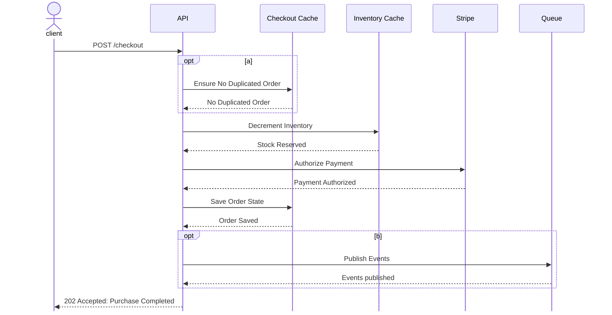
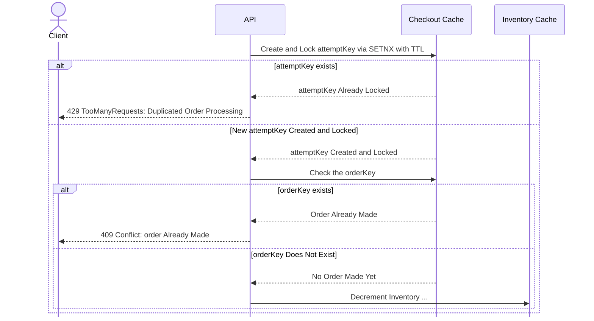
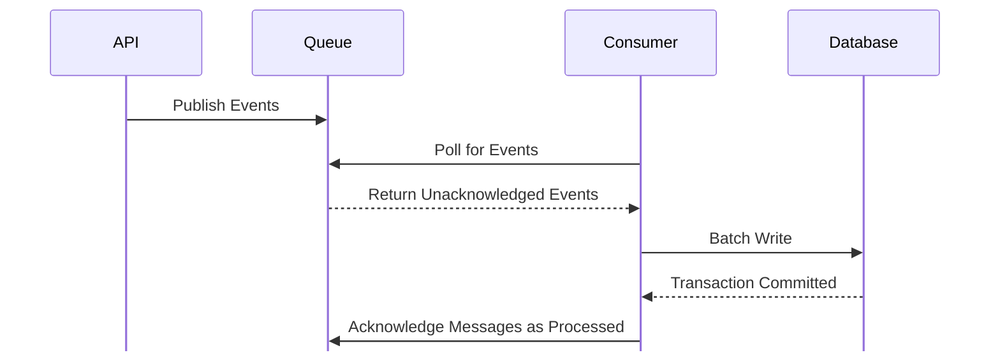

# Design

## Problem Statement
Anti-botting solutions for high-demand physical item releases are currently incomplete. Existing approaches focus heavily on network-level bans (IP blocking) and payment filtering. Both are easily bypassed by resellers utilizing residential proxy networks and generated Virtual Credit Cards (VCCs).

FairCheckout approaches this problem from a completely different angle. By using the physical delivery address as the strict, normalized unique identifier for orders, we create an un-forgeable bottleneck for resellers, rendering mass automated purchases logistically impossible.

### Goals
FairCheckout must provide a frictionless checkout experience for genuine fans while surviving extreme, sudden bursts of traffic from automated programs.
- **Throughput & Latency**: The system can sustain an average of 5,000 checkout requests per second for 10-minute drop windows, maintaining sub-100ms p99 latency.
- **Inventory Guarantees**: The system never oversells under any circumstances. Inventory decrements must be strictly atomic.
- **Jigging Resistance**: The system enforces a "one-per-household" rule using address normalization to detect address manipulation (jigging) in real-time.

### Non-Goals
FairCheckout is strictly a transaction coordinator with inventory reservation capabilities. It has unavoidable and intended functional limitations. 
- **Traffic Scrubbing**: The system cannot actively detect or block bot traffic at the network level. It relies on the merchant to provide standard edge protection (e.g., Cloudflare Turnstile).
- **Absolute Jigging Prevention**: The system does not guarantee a 0% false-positive and 0% false-negative rate for address matching. We use an aggressive algorithm for address normalization to maintain low latency. This introduces tradeoffs such as occasionally missing sophisticated jigs, and intentionally blocking genuine buyers.
- **Payment Gateway Implementation**: The system does not handle payment processing. We are integrating *Stripe* to handle PCI compliance and card authorization.

## Architecture

[a]. 2 steps are taken to ensure no duplicated orders. In step 1, the system uses `SETNX` to create and lock an `attemptKey` with TTL, which only succeeds if it does not yet exist in the checkout cache. If the `attemptKey` is already in the cache, then an ongoing request is being processed, thus the current request fails. In step 2, the systems checks if an `orderKey` is in the checkout cache. An existing `orderKey` indicates that an order has already been made to the address, thus the current request fails.  
The system uses a `defer` statement to release and delete the `attemptKey` after the request is completed. This enables customers to make future attempts if the current attempt fails. 

[b]. Once a request completes, regardless of outcome, the gateway releases the connection and enqueues the result. Successful transactions are pushed to a Transaction Queue for asynchronous bulk-insertion and payment capture. Simultaneously, all request outcomes (successes and failures) are dispatched to a separate Audit Queue to maintain a complete historical record.  
To maintain low latency, the API Gateway is strictly responsible for validation and payment authorization. No database writes or payment captures occur during the HTTP lifecycle.

A checkout request can fail at different points. The behavior differentiating stages are `Stock Reserved`, `Payment Authorized`, `Events Pushed` (reference EventID document).
- **Before/At `Stock Reserved`**: no change to inventory (1001, 1003).
- **Between `Stock Reserved` and `Payment Authorized`**: an inventory rollback is triggered via `defer` (1005).
- **After `Payment Authorized` and before `Events Pushed`**: payment is voided and an inventory rollback is triggered via `defer` (3001).
- **After `Events Pushed`**: purchase is successful, and the HTTP status is guaranteed to be 202 Accepted. Any failure after this point is purely internal, logged, and mitigated by the retry/ACK lifecycle.

## Data Modeling
## Design Choices
### 2 Keys 